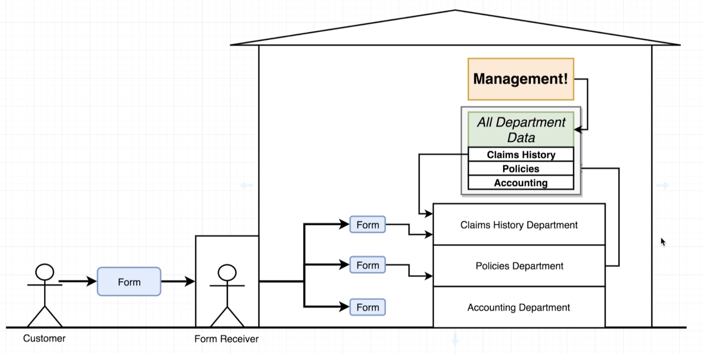
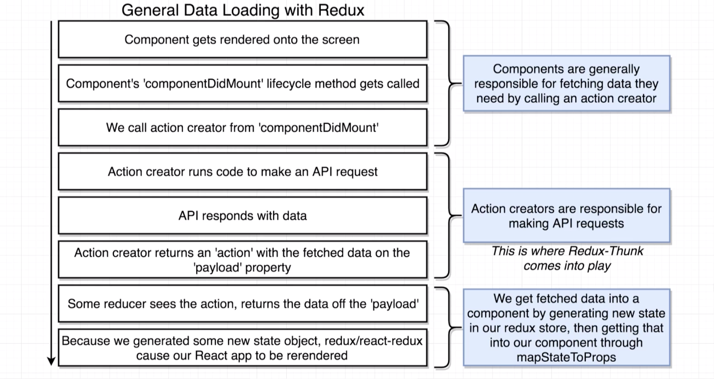
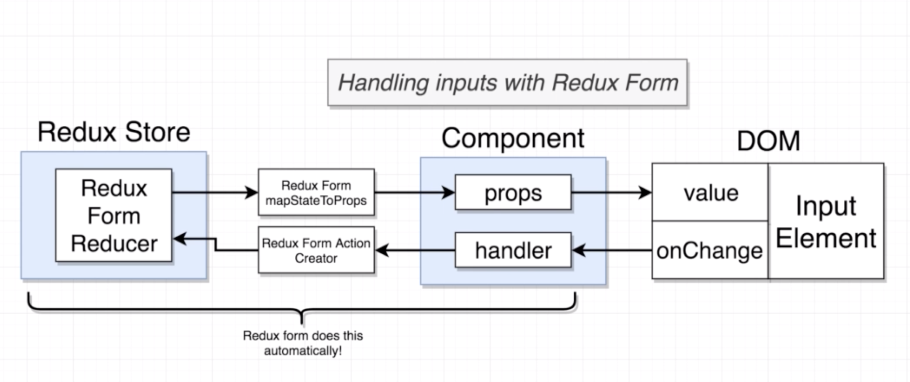
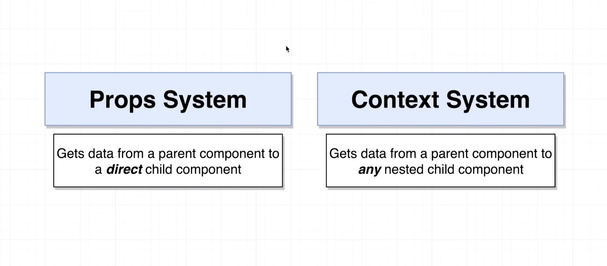
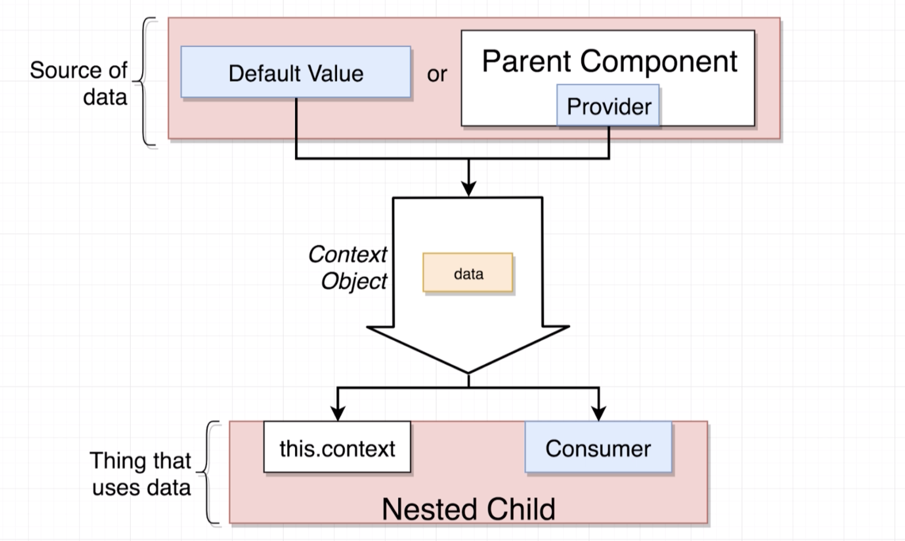
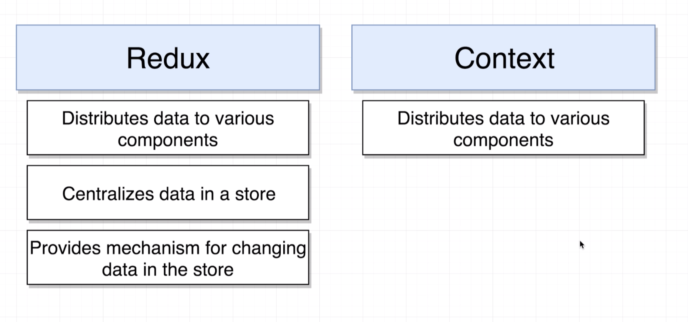
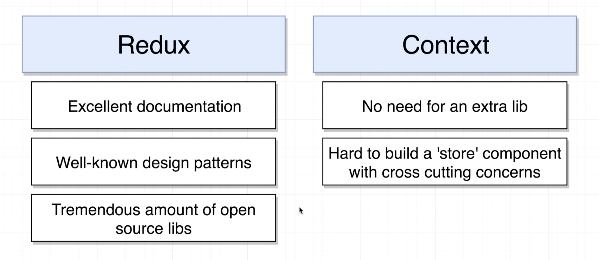

# REACT + REDUX
- React [?](https://reactjs.org/)
- Redux [?](https://redux.js.org/)


## React Components
> A component is a "__Function__" or "__Class__" that "__Renders HTML__" (_by JSX_) to be displayed to user and "__Handles__" (_by Event Handlers_) user interaction.

### Setup
1. Import the React and ReactDOM libraries
```js
import React from 'react';
import ReactDOM from 'react-dom';
```

2. Create a react component
```js
const MyComponent = () => {
    return (
        <div>My Component</div>
    );
};
```

3. Display the react component on the screen
```js
ReactDOM.render(<App/>, document.getElementById('root'));
```

### 3 Concept
1. Component Nesting: _A component can be shown inside another one_
2. Component Reusability: _A component can be easily reused through out the application_
3. Component Configuration: _A component can be configured when is created_

## Props
> A System to pass data from a parent to a child component, to make a child component configurable by parent

## State
> A JavaScript Object that contains relevant data to a component
> - updating `state` on a component causes the component to almost instantly rerender.
> - `state` must be initialized when a component si created (_the only time we do `this.state` as direct assignment_).
> - `state` can only be updated using the `setState` function.

## Component Lifecycle
> 1. `constructor` do one time setups
> 2. `render` avoid doing anything besides returning JSX
>   * then content is visible ...
> 3. `componentDidMount` do fetch/api calls and initial data loading (one time)
>   * then waiting for any updates ...
> 4. `componentDidUpdate` more data loading every single time and when state/props change
>   * then waiting for component is being no longer visible ...
> 5. `componentWillUnmount` do cleanup

> Also `shouldComponentUpdate`, `getDerivedStateFromProps`, `getSnapshotBeforeUpdate`


### Handle Contexts of `this`
> Uncaught TypeError: Cannot read property 'state' of undefined

##### 1. Use `bind` and `constructor`:
```
class Component {
    constructor(props) {
        super(props);
        this.onChangeHandler = this.onChangeHandler.bind(this);
    }
    
    onChangeHandler(e) {
       // Code ...   
    }
    
    render() {
        <input onChange={this.onChangeHandler} />
    }
}
```

##### 2. Use "ES6 Arrow Function" to Define the Class Method
> __REMINDER on ARROW FUNCTIONS:__
> - "Arrow Function", use "Lexical Scope" (Lexical Environment of the running execution context).
> - An ArrowFunction does not define local bindings for arguments, super, this, or new.target. 
> - Any reference to arguments, super, this, or new.target within an ArrowFunction must resolve to a binding in a lexically enclosing environment. Typically this will be the Function Environment of an immediately enclosing function. 
```
class Component {
    onChangeHandler = (e) => {
        // Code ...   
    }
    
    render() {
        <input onChange={this.onChangeHandler} />
    }
}
```

##### 3. Use "ES6 Arrow Function" to Call the Class Method (**Recommended)
```
class Component {
    
    onChangeHandler(e) {
       // Code ...   
    }
    
    render() {
        <input onChange={(e) => this.onChangeHandler(e)} />
    }
}
```


## Redux

### Redux Components
1. Action Creator
    > A function that creates an action
2. Action
    > An action is a plain object that represents an intention to change the state.  
    Actions are the only way to get data into the store.  
    Action object `{type: 'ACTION_TYPE', payload: {}}`
3. Dispatch
    > A function that takes in an action, makes copies of the action, and sends them out to the reducers.
4. Reducers
    > A function that takes in an action and some existing data, changes the data according to the type and payload of the action, and then sends the updated data to the state.   
    > * Must return any value excluding 'undefined'
    > * Produces `state` using ONLY previous state and the action
    > * Should not reach out of itself to decide what value should be returned (Reducers are pure functions)
    > * Should not mutate its input state argument (copy and return new state)
5. State
    > An object that serves as the central repository of all data from the reducers.

### React-Redux Components
1. Store
    > The Store contains the consolidated reducers and the state.
2. Provider
    > The Provider is a component that has a reference to the Store and provides the data from the Store to the component it wraps.
3. Connect
    > Connect is a function communicates with the Provider. Whatever component we wrap with Connect, that component will be able to get changes in the Store state from the Provider.

### Redux Three Principles
1. Single source of truth
    > The state of your whole application is stored in an object tree within a single store.
2. State is read-only
    > The only way to change the state is to emit an action
3. Changes are made with pure functions
    > To specify how the state tree is transformed by actions, you write pure reducers.

### Redux Analogy
> Here we are mapping the Redux analogy to a very close system like an insurance company


__Insurance Company Components__
1. Customer/Insured
2. Insurance Forms (Policy, Claim)
3. Form Receiver (Insurance Agent)
4. Departments (Policy, Claims, Accounting)
5. Data Center

__Redux Components Mapped to Insurance Company Components__
- Action Creator (Customer)
- Action (Forms)
- Dispatch (Agent)
- Reducers (Departments)
- State (Data Center)

### React Data Loading with Redux


### Redux Middleware
> A middleware is a higher-order function that composes a dispatch function to return a new dispatch function. It often turns async actions into actions.   
> It is useful for logging actions, performing side effects like routing, or turning an asynchronous API call into a series of synchronous actions.   
> * Gets called with every action we dispatch
> * Has ability to STOP, MODIFY actions
> * Mostly used fro dealing with Async actions


__Redux Thunk:__
> Redux Thunk is a commonly used middleware for asynchronous orchestration.   
> A thunk is a "function" that returns another function that takes parameters `dispatch` and `getState`.   
> By `dispatch` we can change any data we want and by `getState` we can read any data we want.


### React Router

__Router Types__
> Important for Deployment
1. Browser Router (Most complicated to deploy on realistic settings)
2. Hash Router (Best for distinguishing between traditional server side routing and client side routing)
3. Memory Router


### Redux Form



### React Context






### React Hooks [?](https://wattenberger.com/blog/react-hooks)
- Reuse/Share stateful logic between components
- Provides ability for functional components to have state and lifecycle methods

| Hook | Goal |
|:-----|:-----|
| `useState` | Allow a functional component to use `component-level state` |
| `useEffect` | Allow a functional component to use `lifecycle methods` |
| `useContext` | Allow a functional component to use the `context system` |
| `useRef` | Allow a functional component to use the `ref system` |
| `useReducer` | Allow a functional component to store data through a `reducer` |


